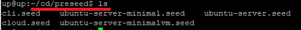

# 实验一 无人值守安装iso制作过程

## 实验目的
* [x] 如何配置无人值守安装iso并在Virtualbox中完成自动化安装
* [x] Virtualbox安装完Ubuntu之后新添加的网卡如何实现系统开机自动启用和自动获取IP？
* [x] 如何使用sftp在虚拟机和宿主机之间传输文件？

## 实验环境

设备
* 主机：win10
* 虚拟机：ubuntu-18.04-server-amd64

网络配置
* NAT
* host-only（192.168.56.102）本网卡用于虚拟机和主机之间的通信

## 实验过程

* 首先在virtualbox安装ubuntu-18.04-server-amd64，然后添加第二块网卡host-only模式，设置该网卡的ip。

  ```
  # 打开配置文件
  vim /etc/netplan/01-netcfg.yaml
  ```

  

  ```
  # 修改后的配置进行应用
  sudo netplan apply
  # 查看ip地址
  ifconfig
  ```

  

* 配置宿主机putty ssh 免密登录虚拟机

    * 首先在虚拟机中安装ssh，使用用户名密码登录到虚拟机。
    ```
    # 安装ssh
    sudo apt install ssh
    # 验证已下载安装好ssh
    pe -e | grep ssh
    ```

    

    * 在宿主机中下载安装putty软件```putty-64bit-0.70-installer```
    * 填入与宿主机同一网段的ip地址```192.168.56.102```

    
    
    * 通过PuTTygen生成公私钥对，同时保存私钥。

    

    * 使用putty登录虚拟机，然后将公钥保存到虚拟机中。
    ```
    mkdir ~/.ssh
    chmod 700 ~/.ssh
    vim ~/.ssh/authorized_keys
    ```

    

    

* 创建iso镜像文件

  * 在虚拟机中：

  ```
  # 下载原iso文件（ubuntu-16.04.1-server-amd64.iso）
  wget http://sec.cuc.edu.cn/ftp/iso/ubuntu-16.04.1-server-amd64.iso
  ```

  
  
  ```
  # 在当前用户目录下创建一个用于挂载iso的文件目录。
  mkdir loopdir
  # 挂载iso镜像文件到这个目录。注意这一步，mount指令需要管理员权限，故需要使用sudo。
  sudo mount -o loop ubuntu-16.04.1-server-amd64.iso loopdir
  # 新建一个目录用于克隆光盘
  mkdir cd
  # 克隆光盘
  rsync -av loopdir/ cd
  # 卸载iso镜像
  sudo umount loopdir
  ```
  至此，可以进入```cd```工作目录下，编辑Ubuntu安装引导界面以增加一个新菜单项入口了。
  ```
  # 进入cd工作目录下
  cd ~/cd
  # 打开文件
  vim isolinux/txt.cfg
  # 添加以下内容到该文件后强制保存退出
  label autoinstall
    menu label ^Auto Install Ubuntu Server
    kernel /install/vmlinuz
    append  file=/cdrom/preseed/ubuntu-server-autoinstall.seed debian-installer/locale=en_US console-setup/layoutcode=us keyboard-configuration/layoutcode=us console-setup/ask_detect=false localechooser/translation/warn-light=true localechooser/translation/warn-severe=true initrd=/install/initrd.gz root=/dev/ram rw quiet
  ```

  

* 最终生成iso镜像文件

  * 将配置完成的```ubuntu-server-autoinstall.seed```保存到```~/cd/preseed/ubuntu-server-autoinstall.seed```目录中
  ```
  sudo wget https://github.com/c4pr1c3/LinuxSysAdmin/blob/master/exp/chap0x01/cd-rom/preseed/ubuntu-server-autoinstall.seed
  ```

  

  

  * 修改isolinux/isolinux.cfg，增加内容timeout 10
  ```
  sudo vim isolinux/isolinux.cfg
  ```
  * 重新生成md5sum.txt。这里一直提示没有权限，可使用```sudo chmod 777 文件```或者```sudo chmod -x 文件```。
  ```
  cd ~/cd && find . -type f -print0 | xargs -0 md5sum > md5sum.txt
  ```
  【注】：```sudo chmod 777 文件```是一种很粗暴的方式，正确做法是使用root用户身份执行```find . -type f -print0 | xargs -0 md5sum > md5sum.txt```。


  

  

  

  * 建立shell脚本
  ```
  # 新建shell文件
  sudo vim shell
  # 添加以下内容到shell文件中
  IMAGE=custom.iso
  BUILD=~/cd/

  mkisofs -r -V "Custom Ubuntu Install CD" \
            -cache-inodes \
            -J -l -b isolinux/isolinux.bin \
            -c isolinux/boot.cat -no-emul-boot \
            -boot-load-size 4 -boot-info-table \
            -o $IMAGE $BUILD
  # 如果目标磁盘之前有数据，则在安装过程中会在分区检测环节出现人机交互对话框需要人工选择
  # 执行shell命令
  bash shell
  # 上条指令执行时提示错误，安装genisoimage
  sudo apt install genisoimage
  ```

  

  

  运行成功后的截图如下：

  

* 将生成的无人值守镜像下载到宿主机中
  ```
  # 使用pscp.exe进行下载
  pscp -l 用户名 -pw 密码 用户名@server:/home/用户名/cd/custom.iso 目标地址
  ```


* 运行生成的录屏链接如下：

  [运行录屏](https://www.bilibili.com/video/av46083295)

  注：本录屏进行了一定的倍速与剪辑。

## 文件对比
* 使用的软件是[在线的编辑器](http://mergely.com/editor)。

【注】：关于文本比对工具:```CLI```方式推荐```vimdiff```。如果是```GUI```方式推荐```meld```；
  
  * 选择所在地区，跳过语言的选择

  
  
  * 检测链接超时，修改dhcp超时时间，启用手工配置网络
  
  
  
  * 配置静态ip
  
  
  
  * 设置主机名、域名。强制使用设定的主机名
  
  
  
  * 设置用户名为```cuc```，密码为```sec.cuc.edu.cn```。
  
  
  
  * 设置时区为上海、关闭时钟矫正机制
  
  

  * 选取最大空闲分区

  

  * LVM方法使用尽可能多的卷组，使用group的预定义方法

  
  
  * 禁用网络镜像
  
  

  * 选择安装server的安装包、安装openssh-server、debootstrap后不选择更新和自动进行安全更新的选项

  

## 遇到的问题与解决方案

* 用VI 编辑器时下面出现这些红字，E45: 'readonly' option is set (add ! to override)

  * 使用:wq!强制保存

* linux中vi保存文件时的“Can't open file for writing”

  * 使用vi命令打开文件时，前面加上sudo来临时提供管理员权限，即使用命令“sudo vi 文件名”打开编辑文件

## 参考资料
[课程资料](https://github.com/c4pr1c3/LinuxSysAdmin/blob/master/chap0x01.exp.md)

[linux-2019-jackcily](https://github.com/CUCCS/linux-2019-jackcily/blob/job1/%E5%AE%9E%E9%AA%8C%E4%B8%80.md)

[linux-2019-luyj](https://github.com/CUCCS/linux-2019-luyj/blob/Linux_exp0x01/Linux_exp0x01/%E5%AE%9E%E9%AA%8C%E6%8A%A5%E5%91%8A_01.md)

[Vim Error E138: Can't write viminfo file $HOME/.viminfo!](https://unix.stackexchange.com/questions/134500/vim-error-e138-cant-write-viminfo-file-home-viminfo)

[linux 中permission denied的解决方法](https://blog.csdn.net/qq_36411874/article/details/54884438)