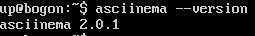

# 第二章：From GUI to CLI（实验）

## 实验要求

- [x] ```vimtutor```

- [x] 自查清单

## 软件环境

* ```Ubuntu 16.04 Server 64bit```

* 在```asciinema```注册一个账号，并在本地安装配置好```asciinema```

## 在本地完成asciinema auth，并在asciinema关联本地账号和在线账号

```
# 安装。
sudo apt install asciinema
# 关联。输入以下指令之后，会返回一个网址。于宿主机打开该网址，关联成功了。
asciinema auth
```
但是在第一节视频录制结束之后，发现录制的结果无法上传到网页上。提示信息显示为不再支持已安装的版本，需要升级到更高版本。找到解决方案：使用```sudo apt install asciinema```安装的只是0.9版本，功能不全。需要重新使用下列方式安装。
```
sudo apt-add-repository ppa:zanchey/asciinema
sudo apt-get update
sudo apt-get install asciinema
```
此时可以发现当前版本为2.0.1



于是，重新完成```vimtutor```第一节。

[第一节](https://asciinema.org/a/ZTPLBHJA5EQscu3nhSI5Wdc30)

[第二节](https://asciinema.org/a/ycjjo2KWGv7f8WbgIyLh7Akkh)

[第三节](https://asciinema.org/a/k9rFZevPKDPkXOHAbhvxVyaFS)

[第四节](https://asciinema.org/a/llcEUTYu7unveeL9YTHX3son0)

[第五节](https://asciinema.org/a/RVO6O7L76hVa5ogWZp9DKy09g)

[第六节](https://asciinema.org/a/cIYA9PL5OtPAficLhvvApxW3F)

[第七节](https://asciinema.org/a/ieC0X61o5hZgW7cP0OUPLP3YY)


## vimtutor完成后的自查清单
* 你了解vim有哪几种工作模式？
    * 正常模式、插入模式、选择模式、命令模式。

* Normal模式下，从当前行开始，一次向下移动光标10行的操作方法？如何快速移动到文件开始行和结束行？如何快速跳转到文件中的第N行？
    * 向下移动十行：```10j```
    * 快速移动到开始行：```gg```
    * 快速移动到结束行：```G```
    * 第N行：```N G```

* Normal模式下，如何删除单个字符、单个单词、从当前光标位置一直删除到行尾、单行、当前行开始向下数N行？
    * 删除单个字符：```x```
    * 删除单个单词：```dw```
    * 删除到行尾：```d$```
    * 删除单行：```dd```
    * 删除向下N行：```Ndd```

* 如何在vim中快速插入N个空行？如何在vim中快速输入80个-？
    * N个空行：```N o```
    * 80个-：```80i-```

* 如何撤销最近一次编辑操作？如何重做最近一次被撤销的操作？
    * 撤销最近的一次编辑操作：```u```
    * 重做最近一次被撤销的操作： ```ctrl+R```

* vim中如何实现剪切粘贴单个字符？单个单词？单行？如何实现相似的复制粘贴操作呢？
    * 单个字符剪切粘贴：```x p```
    * 单个单词：```dw p```
    * 单行：```dd p```

* 为了编辑一段文本你能想到哪几种操作方式（按键序列）？
    * ```vim FILE```。```i```进入编辑模式，完成后，```Esc```返回正常模式。```:wq```用于保存并退出。

* 查看当前正在编辑的文件名的方法？查看当前光标所在行的行号的方法？
    * ```ctrl+G```

* 在文件中进行关键词搜索你会哪些方法？如何设置忽略大小写的情况下进行匹配搜索？如何将匹配的搜索结果进行高亮显示？如何对匹配到的关键词进行批量替换？
    * 关键字搜索：```/ignore```
    * 忽略大小写：```:set ic```
    * 高亮显示：```:set hls is```
    * 批量替换：```:%s/a/b/g``` 将a换为b

* 在文件中最近编辑过的位置来回快速跳转的方法？
    * 向前：```ctrl+I```
    * 向后：```ctrl+O```

* 如何把光标定位到各种括号的匹配项？例如：找到(, [, or {对应匹配的),], or }
    * 移动光标到需要匹配的括号
    * ```%``` 进行匹配

* 在不退出vim的情况下执行一个外部程序的方法？
    * 使用```:! + 外部程序的指令```

* 如何使用vim的内置帮助系统来查询一个内置默认快捷键的使用方法？如何在两个不同的分屏窗口中移动光标？
    * 使用方法查询：```:help```
    * 在两个不同的分屏窗口中移动光标：```ctrl+W```


## 参考资料

[Linux终端录制](https://www.jianshu.com/p/0e83b331aec4)
[2015-linux-public-songyawen/exp2/vim学习.md](https://github.com/CUCCS/2015-linux-public-songyawen/blob/master/exp2/vim%E5%AD%A6%E4%B9%A0.md)
