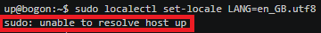
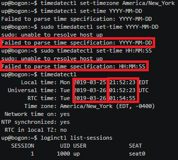

# 第三章实验：动手实战Systemd

## 实验要求

* [Systemd 入门教程：命令篇 by 阮一峰的网络日志](http://www.ruanyifeng.com/blog/2016/03/systemd-tutorial-commands.html)

* [Systemd 入门教程：实战篇 by 阮一峰的网络日志](http://www.ruanyifeng.com/blog/2016/03/systemd-tutorial-part-two.html)

    * 参照第2章作业的要求，完整实验操作过程通过[asciinema](https://asciinema.org)进行录像并上传，文档通过github上传

## 实验环境

* ```Ubuntu 16.04 Server 64bit```

* 在```asciinema```注册一个账号，并在本地安装配置好```asciinema```

## 命令篇

### 因为一部分命令为重启关闭系统、切断电源等命令，所以无法录制。采用如下方式列出。

```bash
# 重启系统
$ sudo systemctl reboot

# 关闭系统，切断电源
$ sudo systemctl poweroff

# CPU停止工作
$ sudo systemctl halt

# 暂停系统。「挂起」系统：系统当前运行时状态数据保存到「内存」，此时笔记本电脑还会有电池电量消耗，唤醒电脑速度快。
$ sudo systemctl suspend

# 让系统进入冬眠状态。 让系统进入「休眠」状态：系统当前运行时状态数据保存到「硬盘」，此时笔记本电脑完全不会有电量消耗，唤醒电脑速度相比 suspend 稍慢。
$ sudo systemctl hibernate

# 让系统进入交互式休眠状态。同时执行「休眠」和「挂起」，此时笔记本电脑还会有电池电量消耗。当电量耗尽后，再次开机执行 hibernate 恢复操作。
$ sudo systemctl hybrid-sleep

# 启动进入救援状态（单用户状态）
$ sudo systemctl rescue
```

以下为命令篇```asciinema```录屏链接：

[systemd-01-系统管理](https://asciinema.org/a/DzB74L3Z67ghuDZKUfq5fY729)

其中，错误原因总结。

* 在执行sudo命令时，报错如下：
    ```bash
    sudo : unable to resolve host up
    ```
    这是因为在前面实验中，设置主机名时，没有再次改回。重新设置为原来的主机名，问题解决。

    

* 在执行```timedatectl```的设置当前时区时，报错如下:
    ```bash
    failed to parse time specification : YYYY-MM-DD
    failed to parse time specification : HH:MM:SS
    ```
    这是因为当前时区设置即为```YYYY-MM-DD```和```HH:MM:SS```形式。
    
    

[systemd-02-Unit](https://asciinema.org/a/X6uDMsS3yMzgVW1hEsUEmHHAD)

* 但是在设置某个unit的指定属性时出现错误：
    ```bash
    failed to set unit properties on httpd.service: unit httpd.service not found
    ```
    推测是因为httpd.service虽然存在底层参数，但是没有处于启动状态，因此找不到httpd.service，进一步不能设置指定参数。
    * 老师的回复：可以通过`systemctl list-unit-files | grep httpd`发现因为当前系统中没有定义`httpd.service`这个服务，所以在其他`Unit`需要依赖这个服务的时候当然就会报错:`not found`了；

[systemd-03-Unit的配置文件](https://asciinema.org/a/56YLa5pC2mGPVru3pNlWTdqKT)

* 以下为配置文件的```Unit```区块
    ```bash
    # [Unit]区块通常是配置文件的第一个区块，用来定义 Unit 的元数据，以及配置与其他 Unit 的关系。
    # 简短描述
    Description
    # 文档地址
    Documentation
    # 当前 Unit 依赖的其他 Unit，如果它们没有运行，当前 Unit 会启动失败
    Requires
    # 与当前 Unit 配合的其他 Unit，如果它们没有运行，当前 Unit 不会启动失败
    Wants
    # 与Requires类似，它指定的 Unit 如果退出，会导致当前 Unit 停止运行
    BindsTo
    # 如果该字段指定的 Unit 也要启动，那么必须在当前 Unit 之后启动
    Before
    # 如果该字段指定的 Unit 也要启动，那么必须在当前 Unit 之前启动
    After
    # 这里指定的 Unit 不能与当前 Unit 同时运行
    Conflicts
    # 当前 Unit 运行必须满足的条件，否则不会运行
    Condition...
    # 当前 Unit 运行必须满足的条件，否则会报启动失败
    Assert...
    ```

* 以下为配置文件的```Install```区块
    ```bash
    # [Install]通常是配置文件的最后一个区块，用来定义如何启动，以及是否开机启动。
    # 它的值是一个或多个 Target，当前 Unit 激活时（enable）符号链接会放入/etc/systemd/system目录下面以 Target 名 + .wants后缀构成的子目录中
    WantedBy
    # 它的值是一个或多个 Target，当前 Unit 激活时，符号链接会放入/etc/systemd/system目录下面以 Target 名 + .required后缀构成的子目录中
    RequiredBy
    # 当前 Unit 可用于启动的别名
    Alias
    # 当前 Unit 激活（enable）时，会被同时激活的其他 Unit
    Also
    ```

* 以下为配置文件的```Service```区块
    ```bash
    # [Service]区块用来 Service 的配置，只有 Service 类型的 Unit 才有这个区块。
    # 定义启动时的进程行为。
    Type
    # 默认值，执行ExecStart指定的命令，启动主进程
    Type=simple
    # 以 fork 方式从父进程创建子进程，创建后父进程会立即退出
    Type=forking
    # 一次性进程，Systemd 会等当前服务退出，再继续往下执行
    Type=oneshot
    # 当前服务通过D-Bus启动
    Type=dbus
    # 当前服务启动完毕，会通知Systemd，再继续往下执行
    Type=notify
    # 若有其他任务执行完毕，当前服务才会运行
    Type=idle
    # 启动当前服务的命令
    ExecStart
    # 启动当前服务之前执行的命令
    ExecStartPre
    # 启动当前服务之后执行的命令
    ExecStartPost
    # 重启当前服务时执行的命令
    ExecReload
    # 停止当前服务时执行的命令
    ExecStop
    # 停止当其服务之后执行的命令
    ExecStopPost
    # 自动重启当前服务间隔的秒数
    RestartSec
    # 定义何种情况 Systemd 会自动重启当前服务，可能的值包括always（总是重启）、on-success、on-failure、on-abnormal、on-abort、on-watchdog
    Restart
    # 定义 Systemd 停止当前服务之前等待的秒数
    TimeoutSec
    # 指定环境变量
    Environment
    ```

[systemd-04-Target](https://asciinema.org/a/MPXXJIFD0QZPHqhuowZPleOty)


[systemd-05-日志管理](https://asciinema.org/a/Kjxx8RfOs1gu2RGNQZTjpQR0V)

## 实战篇

以下为实战篇asciinema录屏链接：

[systemd-06-实战篇](https://asciinema.org/a/73QaT7EByXKXmIyttY3HBhLLq)

* 常用命令总结：

    ```bash
    # 运行
    sudo systemctl start name
    # 查看状态
    sudo systemctl status name
    # 终止
    sudo systemctl stop name
    # 结束进程
    sudo systemctl kill name
    # 重新启动
    sudo systemctl restart name
    ```

* ```Install```区块

    ```bash
    # 表示该服务所在的 Target。
    WantedBy字段
    ```

* ```Target```的配置文件
    ```bash
    # 要求basic.target一起运行。
    Requires字段
    # 冲突字段。如果rescue.service或rescue.target正在运行，multi-user.target就不能运行，反之亦然。
    Conflicts字段
    # 表示multi-user.target在basic.target 、 rescue.service、 rescue.target之后启动，如果它们有启动的话。
    After
    # 允许使用systemctl isolate命令切换到multi-user.target。
    AllowIsolate
    ```

## 自查清单
* 如何添加一个用户并使其具备sudo执行程序的权限？

```bash
# 添加用户
adduser username
# 将用户添加到sudo组
sudo usermod -aG sudo username
```

* 如何将一个用户添加到一个用户组？

```bash
sudo usermod -aG groupname username
```

* 如何查看当前系统的分区表和文件系统详细信息？

```bash
fdisk -l
或 
df -T 
```

* 如何实现开机自动挂载Virtualbox的共享目录分区？
```bash
# 安装增强功能 https://virtualboxes.org/doc/installing-guest-additions-on-ubuntu/
sudo apt install virtualbox-guest-x11
# 手动将iso文件挂载，使用mount将/dev/cdrom挂载 
mount -t vboxsf share /mnt/share    
# 编辑/etc/systemd/system/Auto_mount_service_file.service
sudo systemctl enable  Auto_mount_service_file.service
```

* 基于LVM（逻辑分卷管理）的分区如何实现动态扩容和缩减容量？
```bash
# 显示分区情况
sudo lvdisplay
# 扩充容量
sudo lvextend -L +10M /dev/bogon-vg/swap_1
# 缩减容量
sudo lvextend -L -10M /dev/bogon-vg/swap_1
```


* 如何通过systemd设置实现在网络连通时运行一个指定脚本，在网络断开时运行另一个脚本？
```bash
# 网络连通时运行脚本A，网络断开时运行脚本B
# 修改networking.service的设置文件以下的两个字段
ExecStartPost = A
ExecStopPost = B
```

* 如何通过systemd设置实现一个脚本在任何情况下被杀死之后会立即重新启动？实现杀不死？
```bash
# 修改配置文件的Service区块的Request字段，将其值设为always
Restart：always
```

## 参考资料
* [Systemd 入门教程：命令篇 by 阮一峰的网络日志](http://www.ruanyifeng.com/blog/2016/03/systemd-tutorial-commands.html)

* [Systemd 入门教程：实战篇 by 阮一峰的网络日志](http://www.ruanyifeng.com/blog/2016/03/systemd-tutorial-part-two.html)

* [2015-linux-public-yangyisama](https://github.com/CUCCS/2015-linux-public-yangyisama/blob/master/Exp3/Exp3%20Systemd.md)

* [2015-linux-public-songyawen](https://github.com/CUCCS/2015-linux-public-songyawen/blob/master/exp3/%E5%8A%A8%E6%89%8B%E5%AE%9E%E8%B7%B5systemd.md)


## 老师的建议
* 还可以使用 lsblk -f -p 查看分区表的同时查看文件系统详细信息；
* 关于 LVM 实验推荐阅读的教程是： https://wiki.archlinux.org/index.php/LVM_(简体中文)
    * 具体实验操作建议先做扩容实验，再做缩减容量实验
    * 扩容实验之前，可以分别 扩容 Virtualbox 的当前使用中虚拟硬盘（关机后操作） 和新增一块虚拟硬盘作为 2 个不同的 LVM 实验环境：在线（未卸载分区）扩容实验和离线（卸载分区）分区容量大小调整实验
    * 缩减逻辑分区的容量可以使用命令 lvreduce
* Systemd 内置的对网络状态的检查可以 man 7 systemd.special -> 搜索 network 关键词，Systemd 提供的最贴近我们对网络连通性需求的 target 是 network-online.target
    * networkctl status -a 可以从 Systemd 视角查看到当前网络的状态：有助于我们理解 network-online.target 的状态
    * 正确实现 通过systemd设置实现在网络连通时运行一个指定脚本，在网络断开时运行另一个脚本 的方法是使用 networkd-dispatcher ，示例戳👉：https://asciinema.org/a/ND40x8WroOoDwjP2BWiR3ojLI
        * 推荐 man networkd-dispatcher
* 添加新的 Unit 建议在 /etc/systemd/system 目录下创建配置文件
    * 上述建议和 systemd 的配置文件加载优先级次序有关，具体你可以 man systemd.unit

