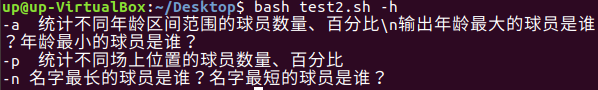

# 第四章 shell脚本编程基础

## 任务一

### 实验要求：
* 任务一：用bash编写一个图片批处理脚本，实现以下功能：
    * 支持命令行参数方式使用不同功能
    * 支持对指定目录下所有支持格式的图片文件进行批处理
    * 支持以下常见图片批处理功能的单独使用或组合使用
        * 支持对jpeg格式图片进行图片质量压缩
        * 支持对jpeg/png/svg格式图片在保持原始宽高比的前提下压缩分辨率
        * 支持对图片批量添加自定义文本水印
        * 支持批量重命名（统一添加文件名前缀或后缀，不影响原始文件扩展名）
        * 支持将png/svg图片统一转换为jpg格式图片

### 实验结果
* 任务一源代码：[test1.sh](test1.sh)
* 帮助信息
```bash
bash test1.sh -h
```


* 对图片进行质量压缩操作与对图片进行保持原始宽高比的压缩分辨率操作
```bash
bash test1.sh -i test.jpg -o output.jpg -cq 50
bash test1.sh -i test.jpg -o output.jpg -cr 50
```


> 质量压缩命令


> 质量压缩结果


> 保持原始宽高比压缩命令


> 保持原始宽高比压缩结果

* 对图片添加自定义文本水印
```bash
bash test1.sh -i test.jpg -o output.jpg -w 'ZhangRuoxu'
```


* 统一添加文件名前缀后缀
```bash
bash test1.sh -i test.jpg -p a
bash test1.sh -i test.jpg -s a
```


* 支持将png/svg图片统一转换为jpg格式图片
```bash
bash test1.sh -t -i test.png -o output.jpg
```
> 这一步没有成功。


## 任务二

### 实验要求
* 任务二：用bash编写一个文本批处理脚本，对以下附件分别进行批量处理完成相应的数据统计任务：
    * 2014世界杯运动员数据
        * 统计不同年龄区间范围（20岁以下、[20-30]、30岁以上）的球员数量、百分比
        * 统计不同场上位置的球员数量、百分比
        * 名字最长的球员是谁？名字最短的球员是谁？
        * 年龄最大的球员是谁？年龄最小的球员是谁？

### 实验结果
* 任务二源代码：[test2.sh](test2.sh)
* 帮助信息
```bash
bash test2.sh -h
bash test2.sh -asdf
```




* 统计不同年龄区间范围数量与百分比,年龄最大最小的球员
```bash
bash test2.sh -a
```


* 统计不同场上位置的球员数量、百分比
```bash
bash test2.sh -p
```


* 名字最长最短的球员
```bash
bash test2.sh -n
```


### 实验要求
* 任务二：用bash编写一个文本批处理脚本，对以下附件分别进行批量处理完成相应的数据统计任务：
    * Web服务器访问日志
        * 统计访问来源主机TOP 100和分别对应出现的总次数
        * 统计访问来源主机TOP 100 IP和分别对应出现的总次数
        * 统计最频繁被访问的URL TOP 100
        * 统计不同响应状态码的出现次数和对应百分比
        * 分别统计不同4XX状态码对应的TOP 10 URL和对应出现的总次数
        * 给定URL输出TOP 100访问来源主机

### 实验结果
* 任务二源代码：[test3.sh](test3.sh)
* 帮助信息
```bash
bash test3.sh -h
```


* 统计访问来源主机TOP 100和分别对应出现的总次数
```bash
bash test3.sh -a
```


* 统计访问来源主机TOP 100 IP和分别对应出现的总次数
```bash
bash test3.sh -b
```


* 统计最频繁被访问的URL TOP 100
```bash
bash test3.sh -c
```


* 统计不同响应状态码的出现次数和对应百分比
```bash
bash test3.sh -d
```


* 分别统计不同4XX状态码对应的TOP 10 URL和对应出现的总次数
```bash
bash test3.sh -e
```


* 给定URL输出TOP 100访问来源主机
```bash
bash test3.sh -f /history/skylab/skylab.html
```


## 参考资料

[课件：第四章-shell脚本编程基础](https://github.com/c4pr1c3/LinuxSysAdmin/blob/master/chap0x04.md)

[shell教程](http://www.runoob.com/linux/linux-shell.html)

[awk教程](http://www.runoob.com/linux/linux-comm-awk.html)

[sed教程](http://www.runoob.com/linux/linux-comm-sed.html)

[linux/2017-1/FitzBC/实验4/](https://github.com/CUCCS/linux/tree/master/2017-1/FitzBC/%E5%AE%9E%E9%AA%8C4)

[linux/2017-1/snRNA/ex4/](https://github.com/CUCCS/linux/tree/master/2017-1/snRNA/ex4)

[LeLeF同学的 yml 配置](https://github.com/CUCCS/linux-2019-LeLeF/blob/chap0x04/.travis.yml)

## 实验总结

* 任务一中的格式转换没有完成。
* shell编程简要概括
    * shell变量
        * 定义不加$.`your_name='asdf'`
        * 使用：`echo ${your_name}` 注：最好写上`{}`
        * 删除：`unset your_name` 注：只读变量`readonly`不能这么删
    * shell字符串
        * 单双引号。转义：`\"${your_name}\"`
        * 获取字符串长度：`echo ${#your_name}`
        * 提取子字符串：`echo ${#your_name:1:4}`
        * 查找子字符串
    * shell数组
        * `数组名=（值1 值2 值3）`
        * 也可单独定义：`array_name[0]=value 0`
        * 读取数组:`${数组名[下标]}`注下标为`@`时表示读取全部元素
        * 获取数组元素的个数:`length=${#array_name[@]}`或`length=${#array_name[*]}` 
        * 获取单个数组元素的长度:`length=${#array_name[n]}`
        * 初始化不需要定义数组大小，由0开始。
    * shell注释
        * `#`
        * `<<EOF  ...   EOF`
    * shell传递参数
        * 向脚本传递参数： `$n` 注n为数字，从0开始。
        * 参数个数：`$#`
        * 作为一个字符串显示：`$*` 注与`$@`区别前者为`"123"`，后者为`"1""2""3"`
    * shell运算符：原生bash不支持简单运算，使用`awk`和`expr`等 
        * 算数运算符：`expr $a + $b` `expr $a - $b` `expr $a \* $b` `expr $a / $b` `expr $a % $b` `expr $a = $b` `expr $a == $b` `expr $a != $b`
        * 关系运算符：`相等[$a -eq $b]` `不等[$a -ne $b]` `a>b [$a -gt $b]` `a<b [$a -lt $b]` `a≥b [$a -ge $b]` `a≤b [$a -le $b]`
        * 布尔运算符：`非!` `或-o` `与-a`
        * 逻辑运算符：`AND &&` `|| OR`
        * 字符串运算符：`相等=` `不等!=` `长度为0 -z` `长度不为0 -n` `不为空 $`
        * 文件测试运算符：用于检测Unix文件的各种属性
    * shell echo 命令
        * 字符串`echo "string"`
        * 转义`echo "\"It's a test.\"`
        * 变量`read name(读取一行输入) echo "$name"`
        * 换行（-e转义）`echo -e "OK!\n"`
        * 不换行`echo -e "OK!\c"`
        * 输出到定向文件`echo "It's a test.">myfile"`
        * 显示命令执行结果```echo `date` ```
        * 可使用单引号规避转义
    * shell printf命令
        * 与c语言的`printf`函数类似
    * shell  test命令
        * 用于检查某个条件是否成立。数值、字符、文件三方面。
    * shell流程控制
        * 单个if
        ```bash
            if...
            then...
            (else...) 
            fi
        ```
        * 多个if
        ```bash
            if...
            then...
            elif...
            then...
            else...
            fi
        ```
        * for
        ```
            for var in...   
            do...   
            done
        ```
        * while
        ```
            while condition   
            do 
                command  
            done
        ```
        * until
        ```
            until condition   
            do 
                command  
            done
        ```
        * case
        ```bash
            case var in ...   
            1) command 
                ;; 
            2) command 
                ;; 
            *) command 
                ;; 
            esac
        ```
        * `break`跳出所有循环`continue`跳出当前循环
    * shell函数
        * 格式：
        ```
            [function] funname [()]
            {
                action;
                [return int;]
            }
        ```
        * 参数：`funWithRaram ...`函数中通过`$n`形式获取参数的值
    * shell输入输出重定向
    * shell文件包含
        * `·filename`
        * `source filename`

