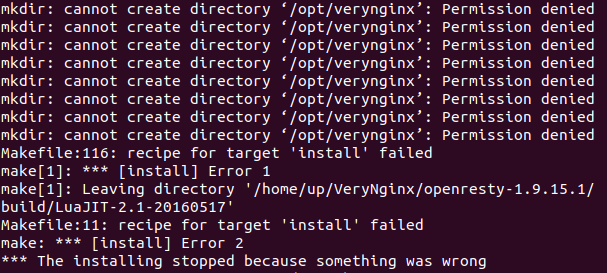
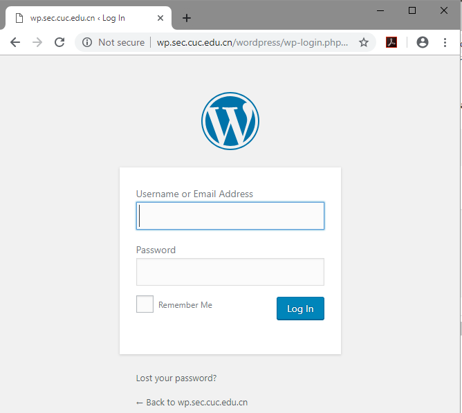
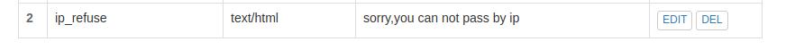

# 第五章：Web服务器（实验）

## 实验要求
### 软件环境建议
* Nginx
* VeryNginx
* WordPress 4.7
* Damn Vulnerable Web Application (DVWA)

### 实验基本要求
* 在一台主机（虚拟机）上同时配置Nginx和VeryNginx
    * VeryNginx作为本次实验的Web App的反向代理服务器和WAF
    * PHP-FPM进程的反向代理配置在nginx服务器上，VeryNginx服务器不直接配置Web站点服务
* 使用Wordpress搭建的站点对外提供访问的地址为： https://wp.sec.cuc.edu.cn 和 http://wp.sec.cuc.edu.cn
* 使用Damn Vulnerable Web Application (DVWA)搭建的站点对外提供访问的地址为： http://dvwa.sec.cuc.edu.cn

### 安全加固要求
* 使用IP地址方式均无法访问上述任意站点，并向访客展示自定义的友好错误提示信息页面-1
* Damn Vulnerable Web Application (DVWA)只允许白名单上的访客来源IP，其他来源的IP访问均向访客展示自定义的友好错误提示信息页面-2
* 在不升级Wordpress版本的情况下，通过定制VeryNginx的访问控制策略规则，热修复WordPress < 4.7.1 - Username Enumeration
* 通过配置VeryNginx的Filter规则实现对Damn Vulnerable Web Application (DVWA)的SQL注入实验在低安全等级条件下进行防护

### VeryNginx配置要求
* VeryNginx的Web管理页面仅允许白名单上的访客来源IP，其他来源的IP访问均向访客展示自定义的友好错误提示信息页面-3
* 通过定制VeryNginx的访问控制策略规则实现：
    * 限制DVWA站点的单IP访问速率为每秒请求数 < 50
    * 限制Wordpress站点的单IP访问速率为每秒请求数 < 20
    * 超过访问频率限制的请求直接返回自定义错误提示信息页面-4
    * 禁止curl访问

## 环境配置
### 网络配置
* 主机：192.167.56.1
    * http://wp.sec.cuc.edu.cn:8080
    * https://wp.sec.cuc.edu.cn
    * http://dvwa.sec.cuc.edu.cn:8080
* 虚拟机：192.168.56.5
    * wordpress 80端口
    * dvwa 5566端口

### windows下面的hosts安装
```bash
# hosts文件在这个目录下
C:\Windows\System32\drivers\etc
# 添加以下内容
192.168.56.5 vn.sec.cuc.edu.cn
192.168.56.5 dvwa.sec.cuc.edu.cn
192.168.56.5 wp.sec.cuc.edu.cn
```

### VeryNginx
* 根据官方手册进行安装[VeryNginx](https://github.com/alexazhou/VeryNginx/blob/master/readme_zh.md)
* 官方`trouble shooting`[故障排查](https://github.com/alexazhou/VeryNginx/wiki/Trouble-Shooting)
* 但是需要先下载一些安装需要的依赖
``` bash 
apt-get install git 
apt-get install libpcre3 libpcre3-dev
apt-get install libssl1.0-dev
apt-get install build-essential
apt-get install zlib1g-dev
apt-get install python
```
* 安装好依赖后进行VeryNginx的安装
```bash
# 克隆仓库
git clone https://github.com/alexazhou/VeryNginx.git

# 进入目录下
cd VeryNginx

# python安装
python install.py install
```
出错



再次尝试
```bash
sudo python install.py install
```
* 修改配置
```bash
sudo vi /opt/verynginx/openresty/nginx/conf/nginx.conf
# 将user从nginx改为www-date
# 修改server监听端口为8080
# 保存退出
```

* 安装成功
    * 启动verynginx，然后通过web面板对verynginx进行配置。
```bash
# 启动服务
/opt/verynginx/openresty/nginx/sbin/nginx

# 停止服务
/opt/verynginx/openresty/nginx/sbin/nginx -s stop

# 重启服务
/opt/verynginx/openresty/nginx/sbin/nginx -s reload

# web 面板地址
http://{{your_machine_address}}/verynginx/index.html

# 默认用户和密码
verynginx / verynginx
```


### Nginx
* 安装mysql数据库
```bash
# 安装mysql
sudo apt-get install mysql-server

# 启动mysql
mysql -u root -p

# 若是失败，执行下面代码切换至管理员，再次启动mysql
sudo su
``` 
* 安装nginx
```bash
# 安装nginx
sudo apt-get install nginx

# 修改nginx server 端口监听为80
sudo vi /etc/nginx/sites-enabled/default
listen 80 default_server;

# 启动nginx
sudo systemctl start nginx
```
* nginx安装完成
```bash
# 访问nginx界面
localhost:80
```


* 安装php
```bash
# 安装php
sudo add-apt-repository universe
sudo apt install php-fpm php-mysql

# 修改nginx配置php-fpm进程的反向代理配置在nginx服务器上
sudo vi /etc/nginx/sites-enabled/default

# 进行以下修改
     location ~ \.php$ {
         include snippets/fastcgi-php.conf;
          fastcgi_pass unix:/var/run/php/php7.2-fpm.sock;
     }
     
 #重新启动nginx
 sudo systemctl restart nginx
```

### wordpress
* 下载wordpress安装包。
```bash
# 下载安装包
sudo wget https://wordpress.org/wordpress-4.7.zip

# 解压安装包
unzip wordpress-4.7.zip

# 新建一个文件夹 
sudo mkdir /var/www/html/wp.sec.cuc.edu.cn

# 将解压后的wordpress移到改路径
sudo cp -r wordpress /var/www/html/wp.sec.cuc.edu.cn
```
* 在mysql中创建一个wordpress的数据库
```bash
# 下载安装mysql数据库
sudo apt-get install mysql-server

# 新建一个数据库wordpress
CREATE DATABASE wordpress DEFAULT CHARACTER SET utf8 COLLATE utf8_unicode_ci;

# 新建一个用户
GRANT ALL ON wordpress.* TO 'wordpressuser'@'localhost' IDENTIFIED BY 'password';

# 刷新
FLUSH PRIVILEGES;

# 退出
EXIT;
```
* 安装php扩展
```bash
# 更新库
sudo apt-get update

# 安装php扩展
sudo apt-get install php-curl php-gd php-intl php-mbstring php-soap php-xml php-xmlrpc php-zip

# 重启php-fpm服务
sudo systemctl restart php7.2-fpm
```
* 配置nginx的配置
```bash
#修改nginx配置 
sudo vi /etc/nginx/sites-enabled/default

#将网站根站点修改为wordpress的安装目录 并保存退出
root /var/www/html/wp.sec.cuc.edu.cn;
```
* 为wordpress配置ssl证书
```bash
# 添加一个新的目录
sudo mkdir /etc/nginx/ssl

# 创建ssl key与证书
sudo openssl req -x509 -nodes -days 365 -newkey rsa:2048 -keyout /etc/nginx/ssl/nginx.key -out /etc/nginx/ssl/nginx.crt

# 一个实例
Country Name (2 letter code) [AU]:US
State or Province Name (full name) [Some-State]:New York
Locality Name (eg, city) []:New York City
Organization Name (eg, company) [Internet Widgits Pty Ltd]:Bouncy Castles, Inc.
Organizational Unit Name (eg, section) []:Ministry of Water Slides
Common Name (e.g. server FQDN or YOUR name) []:your_domain.com
Email Address []:admin@your_domain.com

# 创建的ssl key和证书存放下以下路径
/etc/nginx/ssl

# 修改nginx配置文件
server {
        listen 80 default_server;
        listen [::]:80 default_server ipv6only=on;

        listen 443 ssl;

        root /usr/share/nginx/html;
        index index.html index.htm;

        server_name your_domain.com;
        ssl_certificate /etc/nginx/ssl/nginx.crt;
        ssl_certificate_key /etc/nginx/ssl/nginx.key;

        location / {
                try_files $uri $uri/ =404;
        }
}

# 重启nginx服务
sudo systemctl nginx restart
```

* wordpress安装完成
    * 注：需要在网页端进行wordpress的配置，然后连接数据库，设置完成即可访问wordpress网站。
```bash
# 用户名  
wordpressuser
# 密码    
password
# 数据库  
wordpress
# IP  
127.0.0.1
```



### dvwa
* 下载dvwa，放入指定文件夹。
```bash
# 克隆库
sudo git clone https://github.com/ethicalhack3r/DVWA /tmp/DVWA

# 移动到/var/www/html下
sudo mv /tmp/DVWA /var/www/html
```
* 对文件进行重命名修改
```bash
# 重命名DVWA中的**/config/config.inc.php.dist为/config/config.inc.php**
sudo cp /var/www/html/DVWA/config/config.inc.php.dist /var/www/html/DVWA/config/config.inc.php
```
* 在mysql中创建一个dvwa的数据库
```bash
# 新建一个数据库dvwa
CREATE DATABASE dvwa DEFAULT CHARACTER SET utf8 COLLATE utf8_unicode_ci;

# 新建一个用户dvwauser，分配管理dvwa的权限，设置密码
GRANT ALL ON dvwa.* TO 'dvwauser'@'localhost' IDENTIFIED BY 'p@ssw0rd';

# 刷新
FLUSH PRIVILEGES;

# 退出
EXIT;
 
# 重启mysql生效
sudo systemctl restart mysql
 
# 打开DVWA的配置文件
sudo vim /var/www/html/DVWA/config/config.inc.php

# 对配置文进行修改
$_DVWA[ 'db_server' ]   = '127.0.0.1';
$_DVWA[ 'db_database' ] = 'dvwa';
$_DVWA[ 'db_user' ]     = 'dvwauser';
$_DVWA[ 'db_password' ] = 'p@ssw0rd';
```
* 修改php配置
```bash
# 查看 php版本信息
php -v

# 修改配置文件 并保存退出
sudo vi /etc/php/7.2/fpm/php.ini

# 添加以下代码
allow_url_include = on
allow_url_fopen = on
safe_mode = off
magic_quotes_gpc = off
display_errors = off

# 重启php-fpm使配置生效
sudo systemctl restart php7.2-fpm
```
* 设置DVWA文件夹访问权限
```bash
sudo chown -R www-data.www-data /var/www/html/DVWA
```

* 配置nginx 5566端口监听DVWA的访问
``` bash
# 打开nginx配置文件
sudo vim /etc/nginx/sites-enabled/default

# 添加对应的监听模块
server {
        listen 5566；
        root /var/www/html/DVWA;
        index index.html setup.php index.htm index.php index.nginx-debian.html;
         location / {
                try_files $uri $uri/ =404;
          }
        #配置php-fpm反向代理
        location ~ \.php$ {
                include snippets/fastcgi-php.conf;
                fastcgi_pass unix:/var/run/php/php7.2-fpm.sock;
        }
    }

# 重启nginx使配置生效
sudo systemctl restart nginx
```
* dvwa安装完成
    * 注：点击`setup.php`页面下方的`Create/Reset Database`生成需要使用的数据库。若连接正常，会直接到登录页面，使用`admin/password`


#### 至此，本实验要配置的环境均已配好。

## 实验过程
### 基本要求实现
* 修改nginx配置，wordpress监听80端口，dvwa监听5566端口。
* 在verynginx中配置端口转发
    * 配置matcher
    
    
    
    * 配置upstream
    
    
    
    * 配置proxy
    
    
    
* 修改verynginx配置文件，开启443端口监听。

* 地址总结
```bash
# 访问wordpress
https://wp.sec.cuc.edu.cn 
http://wp.sec.cuc.edu.cn

# 访问dvwa
http://dvwa.sec.cuc.edu.cn
```
### 安全加固要求
* 使用IP地址方式均无法访问上述任意站点，并向访客展示自定义的友好错误提示信息页面-1
    * 添加matcher

    

    * 添加response

    

    * 添加filter

    

    * 结果

    

* DVWA只允许白名单上的访客来源IP，其他来源的IP访问均向访客展示自定义的友好错误提示信息页面-2
    * 添加matcher

    

    * 添加response

    

    * 添加filter

    

    * 结果

    

* 在不升级Wordpress版本的情况下，通过定制VeryNginx的访问控制策略规则，热修复WordPress < 4.7.1 - Username Enumeratio（漏洞复现失败）
    * 检查cookie中是否有wordpress_logged_inxxx字段（判断用户是否已经登录）
    * 添加matcher

    

    * 添加filter

    

* 通过配置VeryNginx的Filter规则实现对Damn Vulnerable Web Application (DVWA)的SQL注入实验在低安全等级条件下进行防护
    * 原则：匹配参数中出现的疑似sql注入字符串，如union、select等等
    * 添加matcher

    

    * 添加response

    

    * 添加filter

    

    * 结果

    

### verynginx配置要求
* VeryNginx的Web管理页面仅允许白名单上的访客来源IP，其他来源的IP访问均向访客展示自定义的友好错误提示信息页面-3
    * 添加matcher

    

    * 添加response

    

    * 添加filter
    

    * 结果
    

* 通过定制VeryNginx的访问控制策略规则实现：
    * 添加response

    

    * 添加频率限制

    

* 禁止curl访问
    * 添加matcher

    

    * 添加filter

        

## 配置文件

[nginx](default)

[verynginx](nginx.conf)

## 参考资料
* [VeryNginx](https://github.com/alexazhou/VeryNginx/blob/master/readme_zh.md)

* [linux/2017-1/FitzBC/实验5/实验报告5_20170329](https://github.com/CUCCS/linux/blob/master/2017-1/FitzBC/%E5%AE%9E%E9%AA%8C5/%E5%AE%9E%E9%AA%8C%E6%8A%A5%E5%91%8A5_20170329.md)

* [linux/2017-1/snRNA/ex5/](https://github.com/CUCCS/linux/tree/master/2017-1/snRNA/ex5)

* [linux-2019-jackcily/job5/实验5.md](https://github.com/CUCCS/linux-2019-jackcily/blob/job5/job5/%E5%AE%9E%E9%AA%8C5.md)

* [Ubuntu中Nginx的安装与配置](
http://www.cnblogs.com/languoliang/archive/2013/04/01/nginx.html)

* [安装zlib1g](https://www.systutorials.com/topic/how-to-install-the-zlib-library-in-ubuntu/)

* [ubuntu无法启动chrome](https://blog.csdn.net/li744831579/article/details/8970384)

* [mysql登录不进去](https://blog.csdn.net/Include_Sea/article/details/81102468)

* [安装wordpress](https://www.digitalocean.com/community/tutorials/how-to-install-wordpress-with-lemp-on-ubuntu-18-04#step-1-%E2%80%94-creating-a-mysql-database-and-user-for-wordpress)

* [wordpress403错误](https://blog.csdn.net/getyouwant/article/details/78070977)

* [Ubuntu 安装MySQL 后登录显示1698（28000）错误代码](https://blog.csdn.net/Include_Sea/article/details/81102468)

* [how-to-create-an-ssl-certificate-on-nginx-for-ubuntu-14-04](https://www.digitalocean.com/community/tutorials/how-to-create-an-ssl-certificate-on-nginx-for-ubuntu-14-04)

* [手动编译nginx并安装verynginx](http://www.cnblogs.com/51ctoedu/p/7990898.html)

